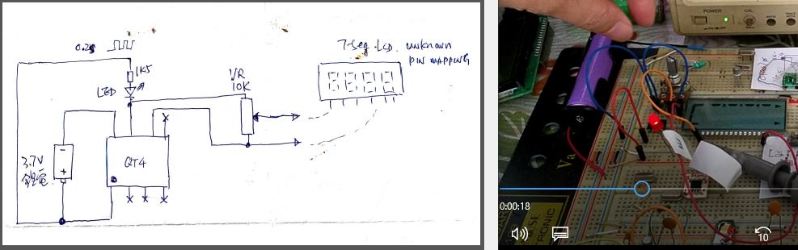

# HC08_FIND_LCD_MAPPING
LCD, find pin mapping, tools and method


### Tool and circuit diagram


### Result
  


###[](https://www.youtube.com/watch?v=0rZ1WW1A2Do)


### source code
```
****************************************************************
*     7-seg LCD tester                      *
******************************************************
* Internal fosc=12.8MHz,

$nolist

; xiaolaba, fit for QT2 / QT4
; 2020-JAN-15
; -------------------
RAM     equ $80
ROM     equ $EE00
prtA    equ $0
pA0.    equ $1
pA1.    equ $2
DDRA    EQU $0004
CONFIG1 EQU $001F
; -------------------

$list
*I/O
*pA0 output LCD test signal
*pA1 output LCD test signal

*VARIABLES
  ORG RAM
cnt01s      RMB 1    ;delay counter

*INITIALIZATION
  ORG ROM
init:
  RSP                ;reset Stack Pointer = $FF
  MOV   #$01,CONFIG1 ;COP disabled
  CLRH               ;clear H:X
  CLRX
  CLRA

  CLR   prtA            ;
  MOV   #pA0.+pA1.,DDRA ;set I/O prtA, output

.page
MAIN:
  lda #%10101010        ;%10101010, binary form, 8 bit
  sta prtA              ;output to port pin
  jsr dly               ;dummy wait 0.2sec
  lda #%01010101        ;flips the bits
  sta prtA              ;output to port pin
  jsr dly               ;dummy wait 0.2sec
  bra MAIN              ;come again


**************************************************************
dly:
;  LDA   #30T          ;delay 3sec
  LDA   #2T          ;delay 0.2sec
lp0:
  JSR   dly01s
  DBNZA lp0
  rts
**************************************************************
dly01s:
  LDX   #250T         ;delay0.1sec
loop:
  DBNZ  cnt01s,loop
  DBNZX loop
  rts
**************************************************************
  ORG $FFFE  ; Vector reset
  FDB init   ; Set start address
```


### firmware
```
S113EE009C6E011F8C5F4F3F006E0304A6AAB700DF
S113EE10CDEE1CA655B700CDEE1C20F0A602CDEE1B
S10FEE20244BFB81AEFA3B80FD5BFB81C0
S105FFFEEE000F
S9030000FC

```
